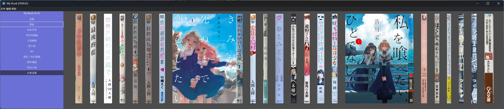

# LifeLibrary （人生文库）

**一款以书脊展示为基础的书籍收集管理器。**

    

## 📖 产品介绍

### 开发背景

因为去年看了很多漫画，又没有地方放这些实体书，所以想着在电脑上写个软件来存放。

用书脊的形式是因为如果是文件夹的形式会让人提不起兴趣打开，而且用书脊来呈现比起很多书封来表示的更贴合日常生活，在同样的屏幕大小里能塞下更多的书籍。

### 目标用户

- 想用书脊形式表现书籍的书籍收藏家

欢迎加群，如果需要我收集的书脊图片的话，我会发在群文件里，也欢迎大家来分享自己收集的图片：https://qm.qq.com/q/ZgNnH2cVWK

### 项目内容

- 书籍的增删查改
- 书架的滑动功能
- 简单的菜单栏和分类边框
- 展示封面
- 搜索书名
- 3d查看器（只是一个长方体）
- 可设置书脊图片整体的高度和间隔
- 可拖拽书籍换位置

### 技术栈

- **开发语言**: gdscript
- **构建工具**: godot

### 截图

